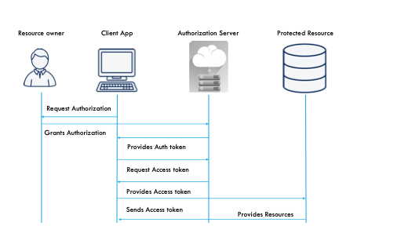
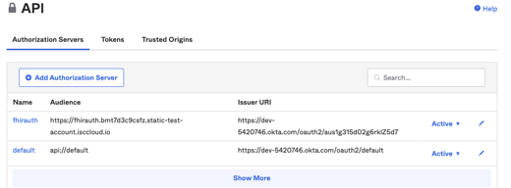
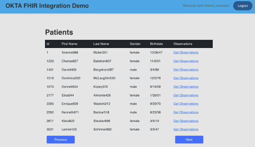

# Oktademo

# OKTA FHIR Integration

## INTRODUCTION

This document describes a sample FHIR application, which was developed to provide a template for building an Angular full stack application in a secure manner using OAuth 2.0. A brief introduction to Oauth2.0 concepts is covered. The application is open source and can be downloaded at: [https://github.com/pjamieso/fhirokta](https://github.com/pjamieso/fhirokta). The app uses the IRIS FHIR Accelerator Service, a cloud based FHIR service, which is easy to deploy. The FHIR Accelerator Service has many useful features including:

• An Enterprise-grade managed FHIR service easily provisioned and launched on AWS

• Support for FHIR R4

• ISO 27001:2013, supporting HIPAA and GDPR, built on the AWS HITRUST-certified platform

• A development portal for understanding and testing FHIR APIs

• Support for multiple methods of authentication including API Key Authentication, OAuth 2.0, and OpenID connect

• Bulk import of FHIR bundles via S3.

• Logging of FHIR request data

Developers can try the service for free by signing up at [https://portal.trial.isccloud.io/account/login](https://portal.trial.isccloud.io/account/login)

The application addresses a practical problem, how to securely retrieve personal health information (PHI), stored in a FHIR server. OAuth 2.0 is a modern security framework enabling distributed authentication and authorization and is the current reigning standard in web security.

However, building an OAuth2.0 application from scratch can be tricky, since development of low-level security code is complex. Nevertheless, there are several good choices for developers, include working with vendor specific libraries, or open-source libraries like [https://github.com/manfredsteyer/angular-OAuth2-oidc](https://github.com/manfredsteyer/angular-oauth2-oidc).

This demo uses the OAuth security server and client library developed by Okta. Okta is well known security provider integrating with many different languages and technologies. Their service features a policy engine that allows administrators complete control over how access is granted and managed. Okta integrates seamlessly with many platforms and devices. Best of all, you can use their service for small scale development for free, see [https://www.okta.com/](https://www.okta.com/).

Okta also supports user management, login and registration out of the box. These essential security features would require considerable development if done from scratch.

This document is organized into several sections, to walk you through enabling your full stack Angular FHIR application working with Oauth 2.0:

- OAUTH Concepts and workflow
- Creating a Custom OKTA Authorization Server
- Registering your application with OKTA
- Registering an OAuth Authentication Server with the IRIS FHIR accelerator service
- Basic Client Okta Auth App Framework
- Viewing the Application&#39;s Main Page and Understanding the JWT Token
- Conclusion

## OAuth KEY Concepts

Before discussing the demo code, it is useful to provide definitions of some key security concepts.

- Authentication is the process of recognizing a user&#39;s identity. It is the mechanism of associating an incoming request with a set of identifying credentials. An Internet-scale authentication protocol needs to be able to determine identity across network and security boundaries.

- An identity provider (abbreviated IdP or IDP) is a system entity that creates, maintains, and manages identity information and authentication services for applications within a distributed network. Authentication management is a non-trivial problem for enterprise scale applications.

Okta can act as an identity provider, as well as integrating with other Identity providers. We will use the Okta identity provider for this sample application.

- Authorization is a security mechanism to determine access levels or user/client privileges related to system resources including files, services, computer programs, data and application features. The process involves granting or denying access to network resources based on the user&#39;s identity.

The FHIR demo application makes use of a custom Okta authorization server, which will supply a JSON Web Token (JWT) that will ultimately be consumed by the IRIS FHIR accelerator service. A valid token will enable the service to release resources to authorized users.

Other common OAuth 2.0 terms include:

- **Resource Owner** : The user that owns the protected resources and can grant access to them. For the demo app, the resource owner is a physician with the right to view all patients&#39; records.
- **Client** : The client is the system that requires access to the protected resources. To access resources, the client must hold the appropriate access token. The demo client is our Angular Application for retrieving and displaying patients and their observations.
- **Authorization Server** : The server that receives requests from the Client for Access Tokens and issues them upon successful authentication and **consent** by the Resource Owner. The authorization server exposes two endpoints: the Authorization endpoint, which handles authentication and consent of the user, and the Token endpoint, which is involved in a machine-to-machine interaction. The Okta authorization server supplies both of these endpoints.
- **Resource Server** : A server that protects the user&#39;s resources and receives access requests from the Client. It accepts and validates an access token from the client and returns the appropriate resources to it. The resource server in this demo is the cloud-based IRIS FHIR accelerator service.
- **Resource Scopes** : Scopes are used to specify exactly what access to resources may be granted. Acceptable scope values, and the resources they relate to, are dependent on the **Resource Server**. Examples used in this demo include: openid, profile, user/Patient.read.

A sequence diagram shows how these actors relate. The diagram depicts the OAuth 2.0 **Authorization Code** workflow. The Client App first request authorization from the resource owner. This authorization grant then goes to the authorization server, which provides an auth token to the client app. The client app uses this to request an access token from the authorization server. The authorization server then returns an access token to the client app, which then uses the token to ask for a protected resource. The protected resource validates the token, and if it is valid, returns the resource to the client application. The tokens are all base 64 encoded JWT tokens that contain the information the resource needs to make a decision whether to grant or deny access.

## Creating a Custom Okta Authorization Server

For our application to create the proper JWT token that can be understood by the IRIS FHIR Accelerator Service, **we must create a custom** Okta Authorization Server. After creating your free Okta account, login and under the security tab, click on +Add Authorization Server.

The demo app uses the custom server&#39;s name fhirauth – you can use any name you like. Most of the settings are filled in for you, except the audience. The audience is the endpoint for the FHIR server, the resource we are trying to protect. In my case that is the IRIS FHIR Accelerator Server at: [https://fhirauth.bmt7d3c9csfz.static-test-account.isccloud.io](https://fhirauth.bmt7d3c9csfz.static-test-account.isccloud.io/), The endpoint for your accelerator instance the endpoint will be different, but similar.

The issuer url is an authorization endpoint which we will need when integrating our Okta Authorization Server with the IRIS FHIR Accelerator Service. This can be found in the Okta Issuer setting, which for this example is [https://dev-5420746.okta.com/OAuth2/aus1g315d02g6rklZ5d7](https://dev-5420746.okta.com/OAuth2/aus1g315d02g6rklZ5d7). Again, your issuer endpoint will be unique and slightly different.

The next property we must set up in our custom Okta authorization server are claims. Claims are name/value pairs that contain information about a user, as well meta-information about the service. The IRIS FHIR Accelerator service requires two claims that are lacking in the default Okta Authorization server, &quot;client\_id&quot; and &quot;scope&quot;. These claims can be added by clicking the &quot;Add Claim&quot; button. The &quot;client\_id&quot; value should be set to app.clientId.

The &quot;scope&quot; claim should be set to the string: &quot;openid profile email user/\*.read&quot;. Notice the scope claims values are delimited by whitespace. The &quot;openid&quot;, &quot;profile&quot;, and &quot;email&quot; are used by OpenID Connect to return user information. The &quot;user/\*.read&quot; scope indicates we wish to give the user read access to all the FHIR resources on the server. If we want to limit access to just particular resources, we could formulate scopes such as &quot;user/Patient.read user/Observation.read user/Encounter.write&quot;, etc. We could also limit the scope to just the resources that match the id of the logged in user, by formulating a scope with &quot;patient/\*.read&quot;. Okta also has the ability to add scopes, but this mechanism should be avoided since the scopes are added to the claim &quot;scp&quot; in a comma delimited array not recognized by the IRIS FHIR Accelerator service. Another tab in the Okta Custom Server is &quot;Access Policies&quot;. Okta provides for granular user/client access. For now, set the Auth Code Access to &quot;All Clients&quot;.

We also need to allow Cross-Origin Resource Sharing (CORS) for our single page web application. CORS is an HTTP-header based mechanism that allows a server to indicate which origins (domain, scheme, or port), other than its own, from which a browser should permit loading resources. CORS relies on a mechanism by which browsers make a &quot;preflight&quot; request to the server hosting the cross-origin resource, to check that the server will permit the actual request. In the preflight, the browser sends headers that will be used in the actual request. If you open up chrome development tools under the network tab you can see these preflight requests. Under the Okta API management tab, you can add trusted origins. We need to add &quot;http://localhost:4200&quot; so that our token requests from our sample angular application are not blocked.

## Registering an application with Okta

Okta permits us to register a small number of applications for free. Under the applications tab, click &quot;create app integration&quot;. Name the application anything you want, in my case OktaFHIRDemo. There are several key pieces of information Okta generates that must be copied and used with the IRIS FHIR Accelerator service and our demo application. They include the Client Id, which looks something like: 0oa1ft32hbJVqlExn5d7 and the Okta Domain, which has the form: dev-5420746.okta.com. Our application type is &quot;single page application&quot;. Single Page Apps (SPAs) offer a great user experience in the browser because they enable interactivity without full page transitions. However, securing SPAs is a challenge because the browser is an inherently insecure environment. When SPAs were new and browsers were more limited in their capabilities, OAuth 2.0 and its sister standard, OpenID Connect (OIDC) offered a security approach called the _Implicit flow_. Today, Proof Key for Code Exchange (PKCE) provides a much more secure solution for protecting SPAs. If you wish to learn more, please see [https://OAuth.net/2/pkce/](https://oauth.net/2/pkce/), but for now select PKCE and Authorization Code as the grant type for the Okta app registration. Authorization code is the most common OAuth 2.0 grant types used by SPAs (together with PKCE), Web Apps, Mobile and native/desktop apps.

After the user is logged in, Okta will send tokens to an endpoint of our choosing. This field is called the redirect URI, choose: [http://localhost:4200/login/callback](http://localhost:4200/login/callback), and for logout choose: [http://localhost:4200](http://localhost:4200/), which is the root of the application.

## Registering an OAuth Authentication Server in the IRIS FHIR Accelerator Service

The IRIS FHIR Accelerator Service has an OAuth2.0 tab, which allows us to register different Authentication/Authorization Servers. Since we have already configured an OKTA authorization server, we merely need to &quot;_create_&quot; an authentication server (choosing the OKTA external authentication server) and provide the Issuer Discovery URL, which in our example was generated by Okta as [https://dev-5420746.okta.com/OAuth2/aus1g315d02g6rklZ5d7](https://dev-5420746.okta.com/oauth2/aus1g315d02g6rklZ5d7). (your url is unique and slightly different)

We also must register our application with the IRIS FHIR Accelerator server using the OktaAuthServer we just created. We can use any name we like but be sure to choose the OktaAuthServer with the above issuer discovery url. The redirect url should match what we configured on the Okta custom server we created: [http://localhost:4200/login/callback](http://localhost:4200/login/callback), and for logout: [http://localhost:4200](http://localhost:4200/). The client id is the id for the registered Okta application, which for this example is: 0oa1ft32hbJVqlExn5d7. The client secret field should be left blank, since it does not apply to the Authorization Code grant type with PKCE.

We have now completed all the server configurations for using OAuth2.0 in the IRIS FHIR Accelerator Service and with OKTA.

## Basic Client Okata Auth APP Framework

The Oktaauthdemo is a simple Angular application with two HTTP services, a Patient and an Observation Service. If there was no need for security these services would retrieve patient and observation information (using a simple HTTP FHIR request) and would display the results in their respective Patients and Observations components. However, we will use **Okta guards** to make the services inaccessible if the user is not logged in. You can see the angular routes and components below. Notice that the &#39;PatientsComponent&#39; and the &#39;ObservationsComponent&#39; are protected by OktaAuthGuards.

constroutes: Routes = [

{ path:&#39;login/callback&#39;, component:OktaCallbackComponent },

{ path:&#39;login&#39;, component:LoginComponent },

{ path:&#39;patients&#39;, component:PatientsComponent, canActivate: [OktaAuthGuard] },

{ path:&#39;observations/:id&#39;, component:ObservationsComponent, canActivate: [OktaAuthGuard] },

{ path:&#39;&#39;, redirectTo:&#39;/patients&#39;, pathMatch:&#39;full&#39; },

{ path:&#39;\*\*&#39;, redirectTo:&#39;/patients&#39;, pathMatch:&#39;full&#39; }

];

There are two important Okta client libraries, installed with NPM that integrate the client application with the Okta server, okta-angular, and the okta-signin-widget. The Okta Sign-In Widget is a JavaScript widget that provides a customizable login screen to authenticate users of web and mobile applications.

The widget creates a Okta&#39;s signin page. Once signed an Okta session cookie is sent to the web browser. The widget can also perform complete OIDC flow and/or integrate with external identity providers. More information can be found at [https://github.com/okta/okta-signin-widget](https://github.com/okta/okta-signin-widget).

The Okta-angular library is a complete SDK to add authentication and authorization to our demo application. To use the Okta SDK, we must first configure it with a separate Typescript config file, I chose the name my-okta-config.ts. We must configure a number of fields in a JavaScript object as shown below.

export default {

oidc: {

clientId: &#39;0oa1ft32hbJVqlExn5d7&#39;,

issuer: &#39;https://dev-5420746.okta.com/oauth2/aus1g315d02g6rklZ5d7&#39;,

redirectUri: &#39;http://localhost:4200/login/callback&#39;,

scopes: [&#39;openid&#39;, &#39;profile&#39;, &#39;email&#39;, &#39;user/\*.read&#39;]

}

}

Notice that of these are the same configuration parameters we use in the IRIS FHIR Accelerator Service and Okta Authorization Server.

The login component relies on the okta signin widget and Okta SDK. The constructor for the login component uses the OktaAuthService and initializes the oktaSignIn component It then waits for a successful response status before redirecting to the OktaCallBackComponent.

[Okta Cache](Images/OktaSignIn.png) .

Note that the sign in component can be customized to provide a logo at the top and through a feature setting can provide a simple registration form and process.

The OktaCallbackComponent caches the access token if registration is successful as shown below with Chrome Development tools.

[Okta Cache](Images/OktaCache.png) .

If the user successfully logs in, the routes for Patient and Observation retrieval are activated. However, for them to get access to the protected FHIR service, the client applications must send a bearer &quot;access token&quot;.

The simplest way to do this is by creating an auth-interceptor-service. The service monitors all HTTP request from the client and when a secured endpoint is recognized, it makes a second request to the Okta Authorization service for an access token and places it in an authorization header with the prefix &quot;Bearer &quot; .

The code below shows how this is done:

private asynchandleAccess( req: HttpRequest\&lt:any, next: HttpHandler ): Promise<<HttpEvent>:any>> {

//only add an access or key for secured endpoints

constsecuredEndpoints = [environment.fhirbaseUrl];

if ( ( securedEndpoints.some( url=>req.urlWithParams.includes( url ) ) ) &amp;&amp; ( environment.xapikey == &#39;&#39; ) ) {

constaccessToken = awaitthis.oktaAuthService.getAccessToken();

//clone the request and add new header with x-api-key

req = req.clone( {

setHeaders: {

Authorization:&#39;Bearer &#39; + accessToken

}

} );

}

returnlastValueFrom( next.handle( req ) );

}

}

Note that the fhirbaseUrl is provided in an environmental variable. Environment variables located in in file, environment.ts, provide a great way to avoid hard coding static application variables, like the FHIR endpoint.

export const environment = {

production: false,

fhirbaseUrl: &quot;https://fhirauth.bmt7d3c9csfz.static-test-account.isccloud.io/oauth2&quot;,

xapikey: &#39;&#39;

};

## Viewing the Application&#39;s Main Page and Understanding the JWT Token

If the user successfully logs in, user information will be displayed in the login status component and the patient query will populate the main page.

 .

If we go to the Network tab in the Chrome Developer tools console, we can get the bearer token, copy it and feed it into the jwt.io debugger ([http://www.jwt.io](http://www.jwt.io/))

This JWT.IO tool takes our base 64 encoded string and returns the following information:

&quot;jti&quot;: &quot;AT.9OnQy0PLUJXrMTKs-eL8su83oqGUv82rYvKl0mdMxTk&quot;,

&quot;iss&quot;: &quot;https://dev-5420746.okta.com/oauth2/aus1g315d02g6rklZ5d7&quot;,

&quot;aud&quot;: &quot;https://fhirauth.bmt7d3c9csfz.static-test-account.isccloud.io&quot;,

&quot;iat&quot;: 1629227956,

&quot;exp&quot;: 1629231556,

&quot;cid&quot;: &quot;0oa1ft32hbJVqlExn5d7&quot;,

&quot;uid&quot;: &quot;00udzljs2C144Q9JR5d6&quot;,

&quot;scp&quot;: [

&quot;profile&quot;,

&quot;user/\*.read&quot;,

&quot;email&quot;,

&quot;openid&quot;

],

&quot;sub&quot;: &quot;patrick.jamieson@intersystems.com&quot;,

&quot;scope&quot;: &quot;openid profile email user/\*.read&quot;,

&quot;client\_id&quot;: &quot;0oa1ft32hbJVqlExn5d7&quot;

}

Note, that in this case the IRIS FHIR accelerator service returned patients and observations since these fields were validated by the Accelerator service. This tool can be useful for when developers are not sure that the correct JWT token has been sent to the resource server, or if they received an &quot;access denied&quot;, 401 response.

## Conclusion

Building a single page web application, using FHIR can be done securely through a client security library specific to your application framework, and a knowledgeable security providers. It is helpful to have a strong mix of tools -- a robust FHIR server, such as the IRIS FHIR Accelerator Service, which allows for easy OAuth 2.0 integration, as well as server and client libraries, like OKTA which implement Oauth 2.0 Authorization code flow using PKCE.

If you have any questions, please drop me a line at [patrick.jamieson@intersystems.com](mailto:patrick.jamieson@intersystems.com)

Patrick W. Jamieson, M.D.

Product Manager, IRIS for Health.

1

OKTA FHIR INTEGRATION DEMO

This project was generated with [Angular CLI](https://github.com/angular/angular-cli) version 12.1.4.

## Development server

Run `ng serve` for a dev server. Navigate to `http://localhost:4200/`. The app will automatically reload if you change any of the source files.

## Code scaffolding

Run `ng generate component component-name` to generate a new component. You can also use `ng generate directive|pipe|service|class|guard|interface|enum|module`.

## Build

Run `ng build` to build the project. The build artifacts will be stored in the `dist/` directory.

## Running unit tests

Run `ng test` to execute the unit tests via [Karma](https://karma-runner.github.io).

## Running end-to-end tests

Run `ng e2e` to execute the end-to-end tests via a platform of your choice. To use this command, you need to first add a package that implements end-to-end testing capabilities.

## Further help

To get more help on the Angular CLI use `ng help` or go check out the [Angular CLI Overview and Command Reference](https://angular.io/cli) page.
